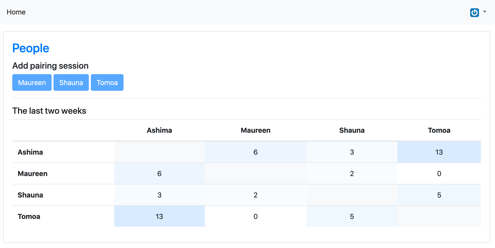

# Pairing

Pairing is a tool to track pairing constellations within teams to ensure
that not the same two people pair all the time (and thus build knowledge silos)

## Trying it

There is a deployed version at https://pairing.prettyrandom.net
If you find bugs, have ideas for features or want to talk about it feel free to create an issue/pr!



## Development

You need to have docker, docker-compose and overmind installed.
Once you do you can run the dev setup using
```sh
overmind start
```

This runs the rails app, webpack dev server, postgres,
two redis instances (cache and sidekiq) and guard for testing
